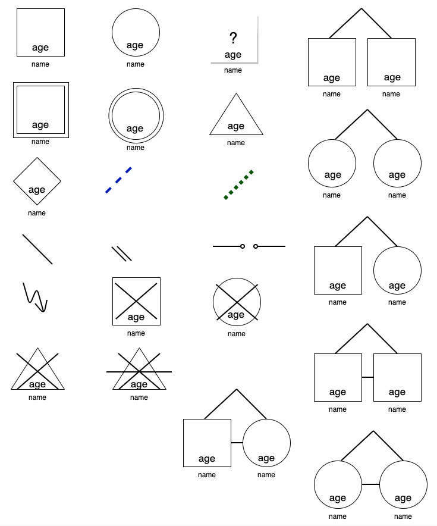

# draw.io genogram library

_(note: draw.io is now called diagrams.net)_

All basic shapes and relationship-types are added as a custom library.

## Usage

[Click here to open the  genogram library for draw.io / diagrams.net](https://app.diagrams.net/?splash=0&clibs=Uhttps%3A%2F%2Fraw.githubusercontent.com%2Fadam-ah%2Fgenogram_drawio%2Fmain%2Fgenogram.xml
)

Alternatively, you can manually import the library from File / Open Library from / URL:

    https://raw.githubusercontent.com/adam-ah/genogram_drawio/main/genogram.xml

## Screenshot

